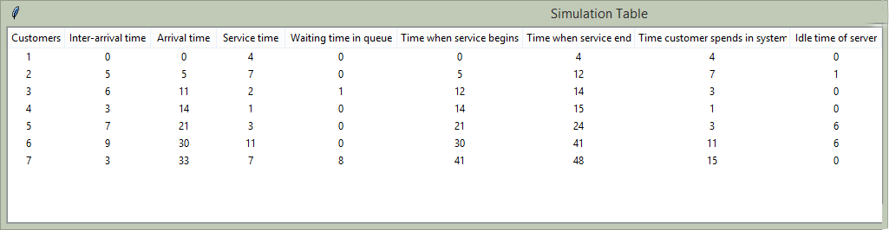

.. eventsim documentation master file, created by
   sphinx-quickstart on Sun Jul  5 21:39:27 2015.
   You can adapt this file completely to your liking, but it should at least
   contain the root `toctree` directive.

.. title:: Simevent Module

Simevent 
========
The Simevent module has three classes namely: **Randomsim**, **Simulate** and **Simtable**. They are all used to simulate discrete events e.g. in a workplace scenario.

Randomsim
---------
**Randomsim** helps to quickly simulate and generate a scenario with random values by just passing your desired argument values into it. It takes between 0 to 3 arguments. The generated results are then stored into the inter-arrival time and service time list needed to generate the rest of the values.

Methods
^^^^^^^
This class has eight methods that can be called on its instance namely:

* intarrival() ----> Displays the inter-arrival time in a list.
* arrival() ----> Displays the arrival time in a list.
* service() ----> Displays the service time in a list.
* servbegin() ----> Display the time service begins in a list.
* servend() ----> Display the time service ends in a list.
* queuewait() ----> Display the time the customer spent waiting in a list.
* custspend() ----> Display the time the customer spent in the system i.e. total time of service.
* idle() ---> Display the idle time of the server (cashier).

Importing the Randomsim class
^^^^^^^^^^^^^^^^^^^^^^^^^^^^^
You can import the Randomsim class in three ways:

.. sidebar:: Note

   The highlighted code for importing should be used along with the highlighted code for creating an instance of the class (usage). Both way of creating an instance takes the same amount of arguments.

.. literalinclude:: ./programs/example.py
      :language: python
      :lines: 64-65,68
      :emphasize-lines: 2,3

and you can then respectively use it like this:

.. literalinclude:: ./programs/example.py
      :language: python
      :lines: 72, 71
      :emphasize-lines: 2

The following examples will cover how arguments are used in the Randomsim class. In the examples, we assume that the class has been imported first as:

.. literalinclude:: ./programs/example.py
  :language: python
  :lines: 65

Example 1a
^^^^^^^^^^
**zero arguments**

What this does is populate the inter-arrival and service time list with random numbers (between 1 and 10) random amount of times (2 to 20). The first value of the inter-arrival time defaults to 0.

.. literalinclude:: ./programs/example.py
  :language: python
  :lines: 70, 77-85
.. line 6 is space

Result 1a
^^^^^^^^^
.. literalinclude:: ./programs/results.txt
  :language: python
  :lines: 103-110

Example 1b
^^^^^^^^^^
**one argument**

Usage: Randomsim(**list size**)

What this does is populate the inter-arrival and service time list with random numbers (between 1 and 10) the amount of times supplied as the only argument value. The first value of the inter-arrival time defaults to 0.

.. literalinclude:: ./programs/example.py
  :language: python
  :lines: 71, 77-85
.. line 6 is space

Result 1b
^^^^^^^^^
.. literalinclude:: ./programs/results.txt
  :language: python
  :lines: 113-121

Example 1c
^^^^^^^^^^
**two arguments**

Usage: Randomsim(**max value**, **list size**)

What this does is populate the inter-arrival and service time list with numbers not more than the first argument starting from 1. The list is populated the amount of times specified as the second argument.

.. literalinclude:: ./programs/example.py
  :language: python
  :lines: 73, 77-84
.. line 6 is space

Result 1c
^^^^^^^^^
.. literalinclude:: ./programs/results.txt
  :language: python
  :lines: 123-130

Example 1d
^^^^^^^^^^
**three arguments**

Usage: Randomsim(**max value for inter-arrival time**, **max value for service time**, **list size**)

What this does is populate the inter-arrival with numbers between 1 and the value passed into the first argument, service time is populated with values between 1 and the second argument while the third argument is the amount/size of the two lists.

.. literalinclude:: ./programs/example.py
  :language: python
  :lines: 74, 77-84
.. line 6 is space

Result 1d
^^^^^^^^^
.. literalinclude:: ./programs/results.txt
  :language: python
  :lines: 133-140

Simulate
---------
**Simulate** helps to quickly simulate and generate a scenario with user-defined values. It is more flexible in that it allows you to input your own data rather than input just numbers as compared to **Randomsim**. It can take one or two arguments which are inter-arrival time list and service time list. They must be of the same length.

Methods
^^^^^^^
This class has eight methods (same as `Randomsim`) that can be called on its instance namely:

* intarrival() ----> Displays the inter-arrival time in a list.
* arrival() ----> Displays the arrival time in a list.
* service() ----> Displays the service time in a list.
* servbegin() ----> Display the time service begins in a list.
* servend() ----> Display the time service ends in a list.
* queuewait() ----> Display the time the customer spent waiting in a list.
* custspend() ----> Display the time the customer spent in the system i.e. total time of service.
* idle() ---> Display the idle time of the server (cashier).

Importing the Simulate class
^^^^^^^^^^^^^^^^^^^^^^^^^^^^^
You can import the Simulate class in three ways:

.. sidebar:: Note

   The highlighted code for importing should be used along with the highlighted code for creating an instance of the class (usage). Both way of creating an instance takes the same amount of arguments.

.. literalinclude:: ./programs/example.py
      :language: python
      :lines: 64,66,68
      :emphasize-lines: 2,3

and you can then respectively use it like this:

.. literalinclude:: ./programs/example.py
      :language: python
      :lines: 76, 87
      :emphasize-lines: 2

The following examples will cover how arguments are used in the Simulate class. In the examples, we assume that the class has been imported first as:

.. literalinclude:: ./programs/example.py
  :language: python
  :lines: 66

Example 2a
^^^^^^^^^^
**one argument**

Usage: Simulate(**inter-arrival list**)

What this does is populate the inter-arrival time with the user-defined argument (**must be a list**) and service time would be automatically generated (populated with numbers between 1 and 10 with the same size as inter-arrival time). 

.. literalinclude:: ./programs/example.py
  :language: python
  :lines: 87, 77-85
.. line 6 is space

Result 2a
^^^^^^^^^
.. literalinclude:: ./programs/results.txt
  :language: python
  :lines: 143-150

Example 2b
^^^^^^^^^^
**two arguments**

Usage: Randomsim(**inter-arrival list**, **service time list**)

What this does is populate the inter-arrival with the first list argument and the service time with the second argument which is then used to calcuate the the rest.

.. literalinclude:: ./programs/example.py
  :language: python
  :lines: 88-89, 78-85
.. line 6 is space

Result 2b
^^^^^^^^^
.. literalinclude:: ./programs/results.txt
  :language: python
  :lines: 153-160

Simtable
--------
**Simtable** is used to display generated results in a tabled format using the tkinter module.

.. note::

  First of all make sure you have **tkinter or Tkinter** installed (Mostly always comes with your python distribution).
  It is advisable to use the **import *** statement if you want to use the Simtable class because of the difference in the old and new tkinter module. If you used the `import *` mentioned previously, the program will try to fix this problem for you. Otherwise, make sure you have imported tkinter or Tkinter (whichever works). or use this:

  .. code:: python

		from eventsim.simevent import *
  
  this should be sufficient to use the table but remember you also need to create an instance of your generated outcome from the **Randomsim** or **Simulate** `class` which can then be passed as the first argument of **Simtable**.

  But if you aren't satisfied with the above code or you still get an error, try this:

  	 .. code:: python

	      from eventsim.simevent import Simtable
	      #Import any other class you want to use here (either Randomsim or simulate)

    .. literalinclude:: ./programs/example.py
      :language: python
      :lines: 96-100

Methods
^^^^^^^
This class has only one method **drawtable()** for representing data in a table.

Importing the Simtable class
^^^^^^^^^^^^^^^^^^^^^^^^^^^^^
You can import the Simtable class in three ways but the third one is the `recommended method`. That way importing the `tkinter` module is not really needed:

.. sidebar:: Note

   The highlighted code for importing should be used along with the highlighted code for creating an instance of the class (usage). Both way of creating an instance takes the same amount of arguments.

.. literalinclude:: ./programs/example.py
      :language: python
      :lines: 64,67-68
      :emphasize-lines: 2,3

and you can then respectively use it like this:

.. literalinclude:: ./programs/example.py
      :language: python
      :lines: 90-91
      :emphasize-lines: 2

The following example will cover how arguments are used in the Simulate class. In the example, we assume that the class has been imported first as:

.. literalinclude:: ./programs/example.py
  :language: python
  :lines: 68

Example 3
^^^^^^^^^
Usage: Simtable(**classInstance**, **parent**)

`where parent must always be Tk()`

.. literalinclude:: ./programs/example.py
  :language: python
  :lines: 88-89, 91-92

Result
^^^^^^

.. note::
	
  Just like the above eample, you can also use it on both the Randomsim and Simulate class instance the same way. sampletable is just an instance of the Simtable and can be any values. In brief, sampletable is an instance of Simtable that takes an instance of any other simevent class as the first argument and Tk() as the second argument.